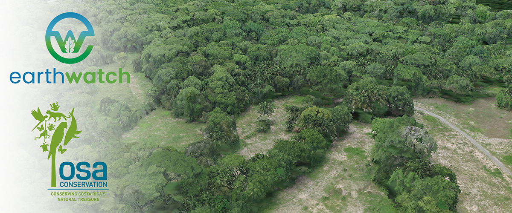

# Introduction

```{r c01, echo=F, message=F, include=F}
knitr::opts_chunk$set(echo = FALSE, message=F, warning=F)

library(dplyr)
library(leaflet)
library(units)
library(sf)
library(viridis)
library(kableExtra)
library(lubridate)
library(plotly)
library(googledrive)
library(purrr)
library(readxl)
library(leaflet.extras)
library(tidyr)

#drive_auth()
googledrive::drive_auth(path = Sys.getenv("GOOGLE_AUTHENTICATION_CREDENTIALS"))
data_path <- "data"
dir.create(data_path) 
#test2
# For when the trapping effort file is sorted
# googledrive::drive_auth(path = Sys.getenv("GOOGLE_AUTHENTICATION_CREDENTIALS"))
# 
```

```{r, echo=F, message=F, warning=F}
knitr::opts_chunk$set(warning = FALSE, message = FALSE)

```

The following represents the data exploration for the data collected during the collaboration between Osa Conservation and Earthwatch for the project entitled:

**A multi-taxa approach comparing the success of active tropical rainforest restoration with old-growth forest in Costa Rica.**

Also known as:

**The Piro Restoration Experiment**

The centralized document for the protocols used in this experiment lives [here](https://docs.google.com/document/d/11z94NQX6Oz3Eoyfs-HaDUQQkKXT1yKlZnzrT5vFTTcM/edit?usp=sharing). Note, as this is a working document only OC staff currently have access. 

## Study area and survey locations

```{r, c02, include=F, message=F, warning=F, results="hide"}
#Import the shapefiles for the maps
dir.create("shapefiles")
shp_folder <- drive_ls(path = as_id("1MhlqBbWVCaSoSiltC3SlGsEvltsVZvkC"), recursive=T)

for(i in 1:nrow(shp_folder))
{
  # if it has a file extension download it
  if(substr(shp_folder$name[i], (nchar(shp_folder$name[i]) - 3),(nchar(shp_folder$name[i]) - 3))==".")
  {
  drive_download(file = as_id(shp_folder$id[i]), path = paste0("shapefiles/", shp_folder$name[i]), overwrite = TRUE)
  }
}

trails <- st_read("shapefiles/trails_osa.shp")
trails<- st_zm(trails, drop = TRUE, what = "ZM")
plots <- st_read("shapefiles/Restoration_experiment_original.shp")
plots <- st_transform(plots, 4326)
plots<- st_zm(plots, drop = TRUE, what = "ZM")
# Update the column name
colnames(plots)[colnames(plots)=="plotID"] <- "plot_id"

#plots_centroid <- st_centroid(plots)

roads <- st_read("shapefiles/roads_osa.shp")

# Import the plot locations
dir.create("data")
data_folder <- drive_ls(path = as_id("1dnLGAUTC0IQ9dSzC4l354whRrBXLNOM1"), recursive=F)
# Subset to just the datafolders
data_folder <- data_folder[substr(data_folder$name,1,4)=="Piro",]

# Replace shortcuts
data_folder <- data_folder %>%
  filter(map_chr(drive_resource, ~ .x$mimeType) != "application/vnd.google-apps.shortcut")


for(i in 1:nrow(data_folder))
{
  drive_download(file = as_id(data_folder$id[i]), path = paste0("data/", data_folder$name[i]), overwrite = TRUE)
}

# Also grab the bird and batbox databases - as they are shortcuts

# Birds
drive_download(file = as_id("19xnEVq_EH3xkZe-Up3iK6hXROm3LUu9rITm7FCI1-9A"), path = paste0("data/", "Piro_Restoration_Experiment_BIRD_DATABASE"), overwrite = TRUE)

# Bats
drive_download(file = as_id("1mI3RhnR0WiuaK3TFnnF46xugKDRttKR8xe-lNCpeeXA"), path = paste0("data/", "Piro_Restoration_Experiment_BATBOX_DATABASE"), overwrite = TRUE)

# Read in the plot locations master list
locs_db <- read_excel("data/Piro_Restoration_Experiment_PLOT_MASTERLIST.xlsx", sheet="survey_locations")  

# Create a spatial map from the plot master list (these should be mid-points)

plots_centroid <- st_as_sf(locs_db, coords = c("longitude", "latitude"),
                         crs = 4326) 


# Download the Wildlife Insights data and format it
data_folder <- drive_ls(path = as_id("1csFLXRj8rNYGlEA06nMn6fP0qC-f7XOA"), recursive=F)

for(i in 1:nrow(data_folder))
{
  drive_download(file = as_id(data_folder$id[i]), path = paste0("data/", data_folder$name[i]), overwrite = TRUE)
}

img <- read.csv("data/images_2008900.csv", header=T)
dep <- read.csv("data/deployments.csv", header=T)

img$project_id <- "PRE"
dep$project_id <- "PRE"

# Prep the dates 

# start dates
dep$start_date <- ymd_hms(paste0(substr(dep$start_date,1,10), " 00:00:01"))

# end dates
dep$end_date   <- ymd_hms(paste0(substr(dep$end_date,1,10), " 23:59:00"))

# camera days
dep$days <- round(interval(dep$start_date, dep$end_date)/ddays(1),0)

dep$feature_type <- substr(dep$placename,4,4)

# Image dates
# Image timestamp
img$timestamp <- ymd_hms(img$timestamp)
#
dep <- dep[duplicated(dep[,c("deployment_id", "placename")])==F,]
img <- left_join(img, dep[,c("deployment_id", "placename")])

dep$plot_id <- substr(dep$placename,4,6)


# Download the plot master list

plot_master  <- read_excel("data/Piro_Restoration_Experiment_PLOT_MASTERLIST.xlsx",
                      sheet="survey_locations")

dep <- left_join(dep, plot_master[,c("plot_id", "simple_treatment")])
```

The following map shows the locations of all the surveys included within this project to date, coloured by simplfied treatment category: active restoration; natural restoration and forest control. 

```{r map4, echo=F, class.source="Rmain"}

# # First, set a single categorical variable of interest from station covariates for summary graphs. If you do not have an appropriate category use "project_id".
# category <- "feature_type"
# 
# # We first convert this category to a factor with discrete levels
# dep[,category] <- factor(dep[,category])
# # then use the turbo() function to assign each level a color
# col.cat <- turbo(length(levels(dep[,category])))
# # then we apply it to the dataframe
# dep$colours <- col.cat[dep[,category]]

plot_master$simple_treatment <- as.factor(plot_master$simple_treatment)

# Create a color palette for the treatments
treatment_colors <- colorFactor(
  palette = c("#984EA3", "#4DAF4A","#E41A1C"),  # adjust number of colors as needed
  domain = plot_master$simple_treatment
)

m <- leaflet(data = plot_master) %>%
  addProviderTiles(providers$Esri.WorldImagery, group = "Satellite") %>%  
  addTiles(group = "Base") %>%
  addPolylines(data = trails, group = "trails", color = "brown") %>% 
  addPolygons(data = plots, popup = plots$plot_id, group = "plots",
              weight = 3) %>% 
  addCircleMarkers(
    lng = ~longitude, 
    lat = ~latitude,
    color = ~treatment_colors(simple_treatment),
    fillColor = ~treatment_colors(simple_treatment),
    radius = 6, 
    stroke = TRUE,
    weight = 1,
    fillOpacity = 0.8,
    popup = ~paste(plot_id, original_treatment,
                   "<br>Treatment:", simple_treatment,
                   "<br>Long:", longitude,
                   "<br>Lat:", latitude),
    group = "survey_locs"
  ) %>%
  addLegend(
    position = "topright",
    pal = treatment_colors,
    values = ~simple_treatment,
    title = "Treatment",
    opacity = 1
  ) %>%
  addLayersControl(
    position = "topleft",
    baseGroups = c("Base", "Satellite"),
    overlayGroups = c("plots", "trails", "survey_locs"),
    options = layersControlOptions(collapsed = FALSE)
  ) %>%
  addFullscreenControl() %>%
  addScaleBar(position = "topright")

m

```

The number of survey locations for each category are as follows:

```{r}
plot_master %>%
  count(simple_treatment) %>%
  kable(col.names = c("Treatment", "Number of Locations")) %>%
  kable_styling(bootstrap_options = c("striped", "hover"), 
                full_width = FALSE)
```


## Historical survey timeline

**NOTE** We still need incorporate the vegetation data [Also - should we add historical dung beetle and butterfly data?]

```{r, include = F, echo = F}
  
# Birds ############################################################

bird_counts <- read_excel("data/Piro_Restoration_Experiment_BIRD_DATABASE.xlsx",
                      sheet="Bird_count_data")
bird_counts <- as.data.frame(bird_counts)

bird_counts$date <- ymd(bird_counts$date)
bird_counts <- bird_counts %>% drop_na(date)

# Note that SOME OF THE bird data has a leading zero. We should remove that
bird_counts$site_date <- paste0(bird_counts$plot_id, "_", gsub("-", "", bird_counts$date))

# Bird effort
bird_effort <- read_excel("data/Piro_Restoration_Experiment_BIRD_DATABASE.xlsx",
                      sheet="Visit_metadata")
bird_effort <- bird_effort[is.na(bird_effort$date)==F,]
table(substr(bird_effort$date,1,4))


# Bats ############################################################
# The bat count data
bat_counts <- read_excel("data/Piro_Restoration_Experiment_BATBOX_DATABASE.xlsx",
                      sheet="bat_monitoring")

bat_counts$date_check <- ymd(bat_counts$date_check)
bat_counts <- bat_counts %>% drop_na(date_check)
# Remove NA;s
bat_counts<- bat_counts[is.na(bat_counts$plot)==F,]

 
# Amphibian data #####################################################
amphib_effort <- read_excel("data/Piro_Restoration_Experiment_AMPHIBIAN_DATABASE.xlsx",
                      sheet="visit_data", col_types = "text")

amphib_effort$date <- as.Date(as.numeric(amphib_effort$date), origin = as.Date("1899-12-30"))
amphib_effort <- amphib_effort %>% drop_na(date)

amphib_caps <- read_excel("data/Piro_Restoration_Experiment_AMPHIBIAN_DATABASE.xlsx",
                      sheet="capture_data", col_types = "text")
 
amphib_caps$date <- as.Date(as.numeric(amphib_caps$date), origin = "1899-12-30")


# Rapid vegetation surveys ###############################################
veg_cover <- read_excel("data/Piro_Restoration_Experiment_VEGETATION_MONITORING.xlsx",
                      sheet="rapid_vegetation_survey", col_types = "guess")

head(veg_cover)

# Flooding ################################

flood_dat <- read_excel("data/Piro_Restoration_Experiment_FLOODING_MONITORING.xlsx",
                      sheet="Sheet1", col_types = "guess")

head(flood_dat)

# Sherman trapping - 1Pr0X70oLGreYE3tnq7zkF3FN7kD0oBd71ldeA3_dkBI

sherman_dep <- read_excel("data/Piro_Restoration_Experiment_SHERMAN_TRAPPING_DATABASE.xlsx",
                      sheet="deployment_data", col_types = "guess")

sherman_dep <- sherman_dep[is.na(sherman_dep$start_date)==F,]

sherman_cap <- read_excel("data/Piro_Restoration_Experiment_SHERMAN_TRAPPING_DATABASE.xlsx",
                      sheet="capture_data", col_types = "guess")

```


```{r}
# Make a plotly graph where the survey type is the y0axis and the date is the x axis

# The first bit of data form the whole project is:

survey_types <- c("Birds" = 1, "Bats" = 2, "Camera traps" = 3, "Amphibians" = 4,
                  "Small mammals" = 5)

fig <- plot_ly() %>%
  layout(
    title = "Historical survey data",
    xaxis = list(title = "Year", range = c(ymd("2017-01-01"), Sys.time())),
    yaxis = list(title = "", tickvals = unname(survey_types), ticktext = names(survey_types))
  )

# add birds

fig <- fig %>%
      add_trace(
        x = bird_counts$date,
        y = survey_types[["Birds"]],
        type = "scatter",
        mode = "markers",
        marker = list(size = 10),
        name = "Birds"
      )

# Add bats

fig <- fig %>%
      add_trace(
        x = bat_counts$date_check,
        y = survey_types[["Bats"]],
        type = "scatter",
        mode = "markers",
        marker = list(size = 10),
        name = "Bats"
      )

# Add cameras

fig <- fig %>%
      add_trace(
        x = dep$start_date,
        y = survey_types[["Camera traps"]],
        type = "scatter",
        mode = "markers",
        marker = list(size = 10),
        name = "Cameras"
      )

# Add amphibs

fig <- fig %>%
      add_trace(
        x = amphib_effort$date,
        y = survey_types[["Amphibians"]],
        type = "scatter",
        mode = "markers",
        marker = list(size = 10),
        name = "Amphibians"
      )

fig <- fig %>%
      add_trace(
        x = sherman_dep$start_date,
        y = survey_types[["Small mammals"]],
        type = "scatter",
        mode = "markers",
        marker = list(size = 10),
        name = "Small mammals"
      )


fig
```

## Earthwatch survey timeline

Now lets zoom in on data collected since our collaboration with Earthwatch started:

```{r}
fig %>%
  layout(xaxis = list(range = c(as.Date("2025-02-01"),c(as.Date("2025-12-30") )),
         title = "2025 Survey Data"))
```

And a summary of the number of different surveys conducted by year:

```{r}


# Combine all survey data - counting unique site-date combinations
survey_summary <- bind_rows(
  bird_counts %>% 
    mutate(year = year(date)) %>%
    distinct(plot_id, date, year) %>%
    count(year) %>%
    mutate(survey_type = "Birds"),
  
  bat_counts %>% 
    mutate(year = year(date_check)) %>%
    distinct(plot, date_check, year) %>%
    count(year) %>%
    mutate(survey_type = "Bats"),
  
  dep %>% 
    mutate(year = year(start_date)) %>%
    distinct(placename, start_date, year) %>%
    count(year) %>%
    mutate(survey_type = "Camera traps"),
  
  amphib_effort %>% 
    mutate(year = year(date)) %>%
    distinct(plot_id, date, year) %>%
    count(year) %>%
    mutate(survey_type = "Amphibians"),
  
  sherman_dep %>% 
    mutate(year = year(start_date)) %>%
    distinct(plot_id, start_date, year) %>%
    count(year) %>%
    mutate(survey_type = "Small mammals")
)

# Pivot to wide format with years as columns
survey_table <- survey_summary %>%
  pivot_wider(names_from = year, values_from = n, values_fill = 0) %>%
  mutate(Total = rowSums(across(where(is.numeric)))) %>%
  mutate(survey_type = factor(survey_type, 
                               levels = c("Birds", "Bats", "Camera traps", 
                                          "Amphibians", "Small mammals"))) %>%
  arrange(survey_type) %>%
  # Reorder columns: survey_type, years in order, Total
  select(survey_type, sort(names(.)[names(.) != "survey_type" & names(.) != "Total"]), Total)

# Add column totals row
totals <- survey_table %>%
  summarise(survey_type = "Total", across(where(is.numeric), sum))

survey_table <- bind_rows(survey_table, totals)

# Create the formatted table
survey_table %>%
  kable(col.names = c("Survey Type", names(survey_table)[-1]),
        caption = "Number of unique site-date surveys by type and year") %>%
  kable_styling(bootstrap_options = c("striped", "hover", "condensed"),
                full_width = FALSE) %>%
  row_spec(0, bold = TRUE, background = "#f5f5f5") %>%
  row_spec(nrow(survey_table), bold = TRUE, background = "#f5f5f5")
```


# Bird surveys

## Earthwatch data

```{r, message=F, warning=F}
bird_effort <-bird_counts[, c("plot_id", "date", "site_date")]
bird_effort <- bird_effort[duplicated(bird_effort)==F,] 
bird_effort_2025 <- bird_effort[bird_effort$date>ymd("2025-01-01"),]
be_sum <-  bird_effort %>% group_by(plot_id) %>% summarise(Visits=n())
be_sum <- left_join(plots_centroid, be_sum)


# 2025 summary
#head(bird_effort_2025)
be_2025_sum <-  bird_effort_2025 %>% group_by(plot_id) %>% summarise(Visits=n())
be_2025_sum <- left_join(plots_centroid, be_2025_sum)
# Convert simple features collection to an sf dataframe
be_2025_sum$Visits[is.na(be_2025_sum$Visits)==T] <- 0

# Remove the historical amphibian plots
be_2025_sum <- be_2025_sum[be_2025_sum$taxa!="amphibians",]

# Add the meta data
be_2025_sum <- left_join(be_2025_sum, plot_master)

#2025 records
bird_counts_2025 <- bird_counts[bird_counts$date>ymd("2025-01-01"),]
bird_counts_2025 <- left_join(bird_counts_2025, plot_master)

#

```

Since January 2025, we have visited `r nrow(be_2025_sum[be_2025_sum$Visits>0,])` unique survey locations and performed `r nrow(bird_effort_2025)` point counts, and recorded `r length(unique(bird_counts_2025$common_name))` different species classifications. The mean number of visits was `r round(mean(be_2025_sum$Visits),1)`, minimum = `r min(be_2025_sum$Visits)` max = `r max(be_2025_sum$Visits)`. 

The distribution of survey effort is as follows:

```{r}
library(RColorBrewer)

# Assuming be_2025_sum is already loaded as an sf dataframe

# Define a color palette for the Visits column using discrete values
pal <- colorFactor(
  palette = "YlOrRd", 
  domain = be_2025_sum$Visits,
  levels = sort(unique(be_2025_sum$Visits))
)

# Create the leaflet map
leaflet(be_2025_sum) %>% 
  addTiles() %>% 
  addCircleMarkers(
    radius = 7, 
    color = ~pal(Visits), 
    stroke = FALSE, 
    fillOpacity = 0.8,
    popup = ~paste(plot_id, "<br> Survey Visits:", Visits)
  ) %>% 
  addLegend(
    pal = pal, 
    values = ~Visits, 
    title = "Number of Visits", 
    opacity = 1
  ) %>%
  addScaleBar(position = "topright")
```

The distributions of species detected is as follows:

```{r}
bc_2025_sum <- bird_counts_2025 %>% group_by(common_name) %>% summarise(sample_frequency=n())

# Determine dynamic height based on number of species
num_species <- nrow(bc_2025_sum)
plot_height <- max(400, num_species * 18)  # Minimum height 400px, scales with species count
```

```{r, out.height=plot_height}
# Create a Plotly bar chart
plot <- bc_2025_sum %>%
  arrange(desc(sample_frequency)) %>%  # Sort by frequency
  plot_ly(
    x = ~sample_frequency, 
    y = ~common_name, 
    type = 'bar',
    orientation = 'h',
    marker = list(color = 'steelblue',
    height = plot_height)
  ) %>%
  layout(
    title = "Species Detection Frequency",
    xaxis = list(title = "Detection Frequency"),
    yaxis = list(title = "Species", categoryorder = "total ascending",
                 tickfont = list(size = 10)),
    barmode = 'group'
  )

# Display the plot
plot

#table(bc_2025_sum$sample_frequency==1)/nrow(bc_2025_sum)

```

We can examine the average observed species richness per visits for the simplified treatment categories. 

```{r}

# Remove rows with NA in simple_treatment
bird_counts_2025 <- bird_counts_2025 %>%
  filter(!is.na(simple_treatment))

# Set the treatment order
bird_counts_2025 <- bird_counts_2025 %>%
  mutate(simple_treatment = factor(simple_treatment, 
                                    levels = c("forest", "active_restoration", "passive_restoration")))

# Calculate species richness per site_date
richness_per_visit <- bird_counts_2025 %>%
  group_by(simple_treatment, site_date) %>%
  summarise(species_richness = n_distinct(common_name), .groups = "drop")

# Calculate mean and SD per treatment
richness_summary <- richness_per_visit %>%
  group_by(simple_treatment) %>%
  summarise(
    mean_richness = mean(species_richness),
    sd_richness = sd(species_richness),
    se_richness = sd(species_richness) / sqrt(n()),
    n_surveys = n(),
    .groups = "drop"
  )

ggplot(richness_per_visit, aes(x = simple_treatment, y = species_richness, fill = simple_treatment)) +
  geom_violin(alpha = 0.7, trim = FALSE) +
  geom_boxplot(width = 0.1, fill = "white", outlier.shape = NA) +
  scale_x_discrete(labels = c("forest" = "Forest", 
                               "active_restoration" = "Active Restoration", 
                               "passive_restoration" = "Passive Restoration")) +
  scale_fill_viridis_d(option = "plasma", begin = 0.2, end = 0.8) +
  labs(
    x = "Treatment",
    y = "Species richness per survey",
    title = "Bird species richness by treatment type"
  ) +
  theme_minimal() +
  theme(
    axis.text.x = element_text(angle = 45, hjust = 1, size = 12),
    axis.text.y = element_text(size = 12),
    axis.title.x = element_text(size = 14),
    axis.title.y = element_text(size = 14),
    plot.title = element_text(size = 16),
    legend.position = "none"
  )
```


These simple patterns in species richness do not reflect the complex species specific affinities birds have to the different habitat categories. Examining how frequently the top 20 most frequently detected birds were detected in each survey category reveals this:


```{r}

# Remove rows with NA in simple_treatment
bird_counts_2025 <- bird_counts_2025 %>%
  filter(!is.na(simple_treatment))

# Set the treatment order
bird_counts_2025 <- bird_counts_2025 %>%
  mutate(simple_treatment = factor(simple_treatment, 
                                    levels = c("forest", "active_restoration", "passive_restoration")))

# Calculate survey effort (unique site_dates) per treatment
effort <- bird_counts_2025 %>%
  distinct(simple_treatment, site_date) %>%
  count(simple_treatment, name = "n_surveys")

# Calculate number of site_dates where each species was detected per treatment
detections <- bird_counts_2025 %>%
  distinct(common_name, simple_treatment, site_date) %>%
  count(common_name, simple_treatment, name = "n_detections")

# Join and calculate detection frequency
detection_freq <- detections %>%
  left_join(effort, by = "simple_treatment") %>%
  mutate(detection_rate = n_detections / n_surveys)

# Get top 20 species overall (by total detections across all treatments)
top_20_species <- detection_freq %>%
  group_by(common_name) %>%
  summarise(total_detections = sum(n_detections)) %>%
  arrange(desc(total_detections)) %>%
  slice_head(n = 20) %>%
  pull(common_name)

# Get species order based on forest detection rate
forest_order <- detection_freq %>%
  filter(common_name %in% top_20_species, simple_treatment == "forest") %>%
  arrange(desc(detection_rate)) %>%
  pull(common_name)

# Add any species not detected in forest to the end
forest_order <- c(forest_order, setdiff(top_20_species, forest_order))

# Filter to top 20 and make complete (fill missing combos with 0)
plot_data <- detection_freq %>%
  filter(common_name %in% top_20_species) %>%
  complete(common_name, simple_treatment, fill = list(n_detections = 0, detection_rate = 0)) %>%
  mutate(common_name = factor(common_name, levels = rev(forest_order)),
         # Add column for text color based on detection rate
         text_color = ifelse(detection_rate < 0.3, "white", "black"))

# Create the heatmap
ggplot(plot_data, aes(x = simple_treatment, y = common_name, fill = detection_rate)) +
  geom_tile(color = "white") +
  geom_text(aes(label = scales::percent(detection_rate, accuracy = 1), color = text_color), size = 3) +
  scale_fill_viridis_c(labels = scales::percent_format(), option = "plasma") +
  scale_color_identity() +  # Use the actual color values in text_color column
  scale_x_discrete(labels = c("forest" = "Forest", 
                               "active_restoration" = "Active Restoration", 
                               "passive_restoration" = "Passive Restoration")) +
  labs(
    x = "Treatment",
    y = "",
    fill = "Detection\nfrequency",
    title = "Top 20 bird species detection frequency by treatment"
  ) +
  theme_minimal() +
  theme(
    axis.text.x = element_text(angle = 45, hjust = 1),
    axis.text.y = element_text(size = 9)
  )
```


## Historical 

```{r}
bc_sum <- bird_counts %>% group_by(common_name) %>% summarise(sample_frequency=n())

# Determine dynamic height based on number of species
num_species <- nrow(bc_sum)
plot_height <- max(400, num_species * 18)  # Minimum height 400px, scales with species count
```

Since the start of the project we have visited `r nrow(be_sum[be_sum$Visits>0,])` unique survey locations and performed `r nrow(bird_effort)` point counts, and recorded `r length(unique(bird_counts$common_name))` different species classifications. 

The survey effort (number of locations samples and number of point counts by year) are as follows:

```{r}
bird_effort$year <- year(bird_effort$date)

tmp <- bird_effort %>% group_by(year) %>% summarise(plots_visited=n_distinct(plot_id), total_point_counts=n(), )

knitr::kable(tmp,align = "lrr" ,caption = "Bird survey effort through time")
```

The frequency distributions of the species detected are as follows:

```{r, out.height=plot_height}
# Create a Plotly bar chart
plot <- bc_sum %>%
  arrange(desc(sample_frequency)) %>%  # Sort by frequency
  plot_ly(
    x = ~sample_frequency, 
    y = ~common_name, 
    type = 'bar',
    orientation = 'h',
    marker = list(color = 'steelblue',
    height = plot_height)
  ) %>%
  layout(
    title = "Species Detection Frequency",
    xaxis = list(title = "Detection Frequency"),
    yaxis = list(title = "Species", categoryorder = "total ascending",
                 tickfont = list(size = 10)),
    barmode = 'group'
  )

# Display the plot
plot
```


# Bat data

```{r}

# Why do we have NA's
tmp <- bat_counts %>% group_by(plot) %>% summarise(visits=n())

#kbl(unique(bat_counts$plot))

# Prep the next bubble
# NOTE I DO NOT TRUST THE LOCATION IN THE DATABASE. USE THE SHAPEFILE NYOU HAVE. 

bat_locs <- bat_counts[, c("plot", "latitude", "longitude")]

#take the first of each of these (most likely the most reliable)
bat_first <- bat_locs[duplicated(bat_locs$plot)==F,]


#bat_locs <- bat_locs[duplicated(bat_locs)==F,]


# Setup the date column
bat_counts$date_check <- ymd(bat_counts$date_check)
```

We have been collecting bat data from `r length(unique(bat_counts$plot))` bat boxes, and visited these locations `r max(tmp$visits)` times. They are distributed as follows:

```{r}

# Assuming be_2025_sum is already loaded as an sf dataframe

leaflet(data = bat_first) %>%
  addPolygons(data=plots, popup=plots$plot_id, group="plots") %>%
  addTiles() %>%
  addCircleMarkers(
    lng = ~longitude,
    lat = ~latitude,
    radius = 3,
    color = "darkred",
    fill = TRUE,
    fillOpacity = 0.5,
    popup = ~paste("Plot ID:", plot)
  ) 
  
# Remove the shit location data
bat_counts$latitude <- NULL
bat_counts$longitude <- NULL

bat_counts <- left_join(bat_counts, bat_first)

# Add other meta data
bat_counts <-  left_join(bat_counts, plot_master, by=c("plot"="plot_id"))

bat_counts_2025 <- bat_counts[as.numeric(substr(bat_counts$date_check,1,4))>2024,]

bat_counts_2025$binary <- bat_counts_2025$presence_of_bats=="yes"

colnames(bat_counts)

```

## Earthwatch data only 

```{r}
# Convert columns to numeric and sum
bat_summary <- bat_counts_2025 %>%
  mutate(
    carollia_adult = as.numeric(carollia_adult),
    carollia_pup = as.numeric(carollia_pup),
    glossophaga_adult = as.numeric(glossophaga_adult),
    glossophaga_pup = as.numeric(glossophaga_pup),
    micronycteris_adult = as.numeric(micronycteris_adult),
    micronycteris_pup = as.numeric(micronycteris_pup)
  ) %>%
  summarise(
    carollia_adult = sum(carollia_adult, na.rm = TRUE),
    carollia_pup = sum(carollia_pup, na.rm = TRUE),
    glossophaga_adult = sum(glossophaga_adult, na.rm = TRUE),
    glossophaga_pup = sum(glossophaga_pup, na.rm = TRUE),
    micronycteris_adult = sum(micronycteris_adult, na.rm = TRUE),
    micronycteris_pup = sum(micronycteris_pup, na.rm = TRUE)
  ) %>%
  pivot_longer(everything(), names_to = "category", values_to = "count") %>%
  separate(category, into = c("species", "age_class"), sep = "_") %>%
  mutate(
    species = factor(species, levels = c("carollia", "glossophaga", "micronycteris"),
                     labels = c("Carollia", "Glossophaga", "Micronycteris")),
    age_class = factor(age_class, levels = c("adult", "pup"),
                       labels = c("Adult", "Pup"))
  )
```


In 2025 we checked the bat boxes on `r nrow(bat_counts_2025)` occasions encountering `r sum(bat_summary$count)` individuals. On average the bat boxes were occupied `r round(sum(bat_counts_2025$binary)/nrow(bat_counts_2025),2)*100`% of the time.

```{r}
# Define colors
plasma_colors <- viridis(2, option = "plasma", begin = 0.2, end = 0.8)

# Create grouped bar chart
plot_ly(
  data = bat_summary,
  x = ~species,
  y = ~count,
  color = ~age_class,
  colors = plasma_colors,
  type = "bar"
) %>%
  layout(
    title = "Bat Captures by Species and Age Class (2025)",
    xaxis = list(title = "Species"),
    yaxis = list(title = "Number of Individuals"),
    barmode = "group",
    legend = list(title = list(text = "Age Class"))
  )
```


## Survey effort through time

```{r}
plot_types <- data.frame(locs = unique(bat_counts$plot), id=1:length(unique(bat_counts$plot)))

# Order
plot_types <- plot_types[order(plot_types$locs),] 

plot_height <- max(300, min(nrow(plot_types) * 30, 800))

fig <- plot_ly(height=plot_height) %>%
  layout(
    title = "Bat Survey Effort Through Time",
    xaxis = list(title = "Year", range = c(min(bat_counts$date_check), Sys.time())),
    yaxis = list(title = "Plot id", tickvals = plot_types$id, ticktext = plot_types$locs)
  )

# add birds
i <- 1
for(i in 1:nrow(plot_types))
{
    fig <- fig %>%
      add_trace(
        x = bat_counts$date_check[bat_counts$plot==plot_types$locs[i]],
        y = i,
        type = "scatter",
        mode = "markers",
        marker = list(size = 5),
        name = plot_types$locs[i]
      )
  
}

fig

```


## Overall bat occupancy through time

To understand the long term patterns in bat use of the nest boxes, we can look at the probability of a bat occupying the boxes or not through time: 

```{r}
bat_counts$binary <- NA
bat_counts$binary[bat_counts$presence_of_bats=="yes"] <- 1
bat_counts$binary[bat_counts$presence_of_bats=="no"] <- 0
bat_counts$month <- ym(substr(bat_counts$date_check,1,7))
tmp <- bat_counts[is.na(bat_counts$binary)==F,] %>% group_by(month) %>% summarise(occ=sum(binary)/n())

# Make the plot
plot_ly(
  data = tmp,
  x = ~month,
  y = ~occ,
  type = 'scatter',
  mode = 'lines+markers',  # line with points
  line = list(color = 'darkred'),
  marker = list(size = 8, color = 'darkred')
) %>%
  layout(
    title = "Bat occupancy Over Time",
    xaxis = list(title = "Date"),
    yaxis = list(title = "Occupancy",range = c(0, 1))
  )


```

## Treatment specific occupancy through time

```{r}

# Summarise by month and simple_treatment
tmp <- bat_counts[is.na(bat_counts$binary) == FALSE, ] %>% 
  group_by(month, simple_treatment) %>% 
  summarise(occ = sum(binary) / n(), .groups = "drop")

# Set treatment order and convert month to Date
tmp <- tmp %>%
  mutate(simple_treatment = factor(simple_treatment, 
                                    levels = c("forest", "active_restoration", "passive_restoration")),
         month = as.Date(month),
         month_numeric = as.numeric(month))

# Fit spline smoothers for each treatment
spline_data <- tmp %>%
  group_by(simple_treatment) %>%
  arrange(month_numeric) %>%
  do({
    fit <- smooth.spline(.$month_numeric, .$occ, spar = 0.6)
    new_x <- seq(min(.$month_numeric), max(.$month_numeric), length.out = 100)
    pred <- predict(fit, new_x)
    data.frame(
      month_numeric = pred$x,
      fitted = pred$y,
      simple_treatment = unique(.$simple_treatment)
    )
  }) %>%
  ungroup() %>%
  # Convert numeric back to Date
  mutate(month = as.Date(month_numeric, origin = "1970-01-01"))

# Also ensure tmp$month is Date class
tmp <- tmp %>%
  mutate(month = as.Date(month_numeric, origin = "1970-01-01"))

# Define viridis plasma colors to match bird plots
plasma_colors <- viridis(3, option = "plasma", begin = 0.2, end = 0.8)
names(plasma_colors) <- c("forest", "active_restoration", "passive_restoration")

# Make the plot
plot_ly() %>%
  # Add spline smoothers
  add_trace(
    data = spline_data,
    x = ~month,
    y = ~fitted,
    color = ~simple_treatment,
    colors = plasma_colors,
    type = 'scatter',
    mode = 'lines',
    line = list(width = 2),
    showlegend = FALSE
  ) %>%
  # Add markers for actual data points
  add_markers(
    data = tmp,
    x = ~month,
    y = ~occ,
    color = ~simple_treatment,
    colors = plasma_colors,
    marker = list(size = 8),
    name = ~simple_treatment
  ) %>%
  layout(
    title = "Bat Occupancy Over Time",
    xaxis = list(
      title = "Date",
      type = "date",
      tickformat = "%b %Y"  # Format as "Jan 2025"
    ),
    yaxis = list(title = "Occupancy", range = c(0, NA)),
    legend = list(
      title = list(text = "Treatment"),
      itemsizing = "constant"
    )
  )

```

# Amphibian data

```{r}
amphib_effort$year <- as.numeric(substr(amphib_effort$year,1,4))
amphib_effort$treatment <- substr(amphib_effort$plot_id,1,1)
amphib_effort <- left_join(amphib_effort, plot_master[,c("plot_id", "simple_treatment")])

amphib_effort$plot_id <- as.factor(amphib_effort$plot_id)
amphib_effort_2025 <- amphib_effort[amphib_effort$year==2025,]

amphib_2025_sum <- amphib_effort_2025 %>% group_by(plot_id, .drop = FALSE) %>% summarise(visits=n(),)
table(amphib_2025_sum$plot_id)
# Left join the locations

amphib_2025_sum <- left_join(plots_centroid, amphib_2025_sum)
amphib_2025_sum$visits[is.na(amphib_2025_sum$visits)==T] <- 0


# Sort the capture database
amphib_caps$count <- as.numeric(amphib_caps$count)
amphib_caps <- left_join(amphib_caps,plot_master[,c("plot_id", "simple_treatment")] )

amphib_caps_2025 <- amphib_caps[substr(amphib_caps$date,1,4)=="2025",]


```

In 2025 we conducted a total of `r nrow(amphib_effort[amphib_effort$year==2025,])` amphibian surveys. They were distributed as follows:

```{r}
library(RColorBrewer)

# Assuming be_2025_sum is already loaded as an sf dataframe

# Define a color palette for the Visits column using discrete values
pal <- colorFactor(
  palette = "YlOrRd", 
  domain = amphib_2025_sum$Visits,
  levels = sort(unique(amphib_2025_sum$visits))
)

# Create the leaflet map
leaflet(amphib_2025_sum) %>% 
  addTiles() %>% 
  addCircleMarkers(
    radius = 7, 
    color = ~pal(visits), 
    stroke = FALSE, 
    fillOpacity = 0.8,
    popup = ~paste(plot_id, "<br> Survey Visits:", visits)
  ) %>% 
  addLegend(
    pal = pal, 
    values = ~visits, 
    title = "Number of Visits", 
    opacity = 1
  ) %>%
  addScaleBar(position = "topright")
```

In total, we detected `r sum(amphib_caps_2025$count)` of `r length(unique(amphib_caps_2025$species))`. The distribution of species detected was as follows: 

```{r}

cap_sum <- amphib_caps_2025 %>% group_by(species) %>% summarise(count=sum(count))

```


```{r}

# Create site_date in effort if not present
amphib_effort_2025 <- amphib_effort_2025 %>%
  mutate(site_date = paste(plot_id, gsub("-", "", date), sep = "_"))

# Get the number of surveys per treatment
effort_summary <- amphib_effort_2025 %>%
  group_by(simple_treatment) %>%
  summarise(n_surveys = n(), .groups = "drop")

# For each species, count number of site_dates where it was detected per treatment
detections <- amphib_caps_2025 %>%
  distinct(species, simple_treatment, site_date) %>%
  count(species, simple_treatment, name = "n_detections")

# Calculate detection probability
detection_prob <- detections %>%
  left_join(effort_summary, by = "simple_treatment") %>%
  mutate(detection_prob = n_detections / n_surveys) %>%
  # Set treatment order
  mutate(simple_treatment = factor(simple_treatment, 
                                    levels = c("forest", "active_restoration", "passive_restoration")))

# Get species order based on forest detection probability
forest_order <- detection_prob %>%
  filter(simple_treatment == "forest") %>%
  arrange(desc(detection_prob)) %>%
  pull(species)

# Add species not in forest to the end
all_species <- unique(detection_prob$species)
forest_order <- c(forest_order, setdiff(all_species, forest_order))

# Complete the data to include zeros and set factor levels
plot_data <- detection_prob %>%
  complete(species, simple_treatment, fill = list(n_detections = 0, detection_prob = 0)) %>%
  left_join(effort_summary, by = "simple_treatment") %>%
  mutate(
    detection_prob = ifelse(is.na(detection_prob), 0, detection_prob),
    species = factor(species, levels = rev(forest_order)),
    text_color = ifelse(detection_prob < 0.3, "white", "black")
  )

# Create heatmap
ggplot(plot_data, aes(x = simple_treatment, y = species, fill = detection_prob)) +
  geom_tile(color = "white") +
  geom_text(aes(label = scales::percent(detection_prob, accuracy = 1), color = text_color), size = 3) +
  scale_fill_viridis_c(option = "plasma", labels = scales::percent_format()) +
  scale_color_identity() +
  scale_x_discrete(labels = c("forest" = "Forest", 
                               "active_restoration" = "Active Restoration", 
                               "passive_restoration" = "Passive Restoration")) +
  labs(
    x = "Treatment",
    y = "",
    fill = "Detection\nprobability",
    title = "Amphibian detection probability by treatment"
  ) +
  theme_minimal() +
  theme(
    axis.text.x = element_text(angle = 45, hjust = 1, size = 12),
    axis.text.y = element_text(size = 10, face = "italic"),
    axis.title.x = element_text(size = 14),
    plot.title = element_text(size = 16)
  )

```


# Small mammal data

So far we have made `r length(unique(sherman_dep$deployment_id))` sherman trap deployments, across `r length(unique(sherman_dep$plot_id))` plots.

The deployments we distributed as follows:

```{r}
library(RColorBrewer)
sherman_dep <- left_join(sherman_dep, plot_master[,c("plot_id", "simple_treatment")], by=c("plot_id"))
sherman_cap$plot_id <- substr(sherman_cap$deployment_id,1,3)
sherman_cap <- left_join(sherman_cap, plot_master[,c("plot_id", "simple_treatment")], by=c("plot_id"))

# Convert to sf object
sherman_sf <- st_as_sf(sherman_dep, coords = c("longitude", "latitude"), crs = 4326)

# Set treatment order
sherman_sf <- sherman_sf %>%
  mutate(simple_treatment = factor(simple_treatment, 
                                    levels = c("forest", "active_restoration", "passive_restoration")))


# Create a color palette for the treatments
treatment_colors <- colorFactor(
  palette = c("#4DAF4A","#984EA3","#E41A1C"),  # adjust number of colors as needed
  domain = sherman_sf$simple_treatment
)

# Create the leaflet map
leaflet(data = sherman_sf) %>% 
  addTiles(group = "Base") %>%
  addProviderTiles(providers$Esri.WorldImagery, group = "Satellite") %>%
  addPolygons(data = plots, popup = plots$plot_id, group = "plots",
              weight = 3, fillOpacity = 0.05) %>% 
  addCircleMarkers(
    radius = 5, 
    color = ~treatment_colors(simple_treatment),
    fillColor = ~treatment_colors(simple_treatment),
    stroke = TRUE,
    weight = 1,
    fillOpacity = 0.8,
    popup = ~paste(plot_id, trap_location, "<br>Treatment:", simple_treatment),
    group = "traps"
  ) %>%
  addLegend(
    position = "topright",
    pal = treatment_colors,
    values = ~simple_treatment,
    title = "Treatment",
    labels = c("Forest", "Active Restoration", "Passive Restoration"),
    opacity = 1
  ) %>%
  addScaleBar(position = "topright") %>%
  addLayersControl(
    position = "topleft",
    baseGroups = c("Base", "Satellite"),
    overlayGroups = c("plots", "traps"),
    options = layersControlOptions(collapsed = FALSE)
  )


```

THe survey effort by treatment was as follows:

```{r}
tmp <- sherman_dep[, c("plot_id", "simple_treatment")][duplicated(sherman_dep[, c("plot_id", "simple_treatment")])==F,]

tmp <- tmp %>%  
  group_by(simple_treatment) %>% 
  summarise(count = n(), .groups = "drop") 

tmp %>%
  kable(col.names = c("Treatment", "Effort"),
        caption = "Small mammal capture sites surveyed by treatment") %>%
  kable_styling(bootstrap_options = c("striped", "hover", "condensed"),
                full_width = FALSE) %>%
  row_spec(0, bold = TRUE, background = "#f5f5f5") 


```


Top date we have recorded `r nrow(sherman_cap)` small mammals. They are as follows:

```{r}

tmp <- sherman_cap %>%  
  group_by(species, simple_treatment) %>% 
  summarise(count = n(), .groups = "drop") %>%
  pivot_wider(names_from = simple_treatment, values_from = count, values_fill = 0) %>%
  # Reorder columns
  select(species, any_of(c("forest", "active_restoration", "passive_restoration"))) %>%
  # Add row totals
  mutate(Total = rowSums(across(where(is.numeric)))) %>%
  arrange(desc(Total))

# Add column totals row
totals <- tmp %>%
  summarise(species = "Total", across(where(is.numeric), sum))

tmp <- bind_rows(tmp, totals)

tmp %>%
  kable(col.names = c("Species", "Forest", "Active Restoration", "Passive Restoration", "Total"),
        caption = "Small mammal captures by species and treatment") %>%
  kable_styling(bootstrap_options = c("striped", "hover", "condensed"),
                full_width = FALSE) %>%
  row_spec(0, bold = TRUE, background = "#f5f5f5") %>%
  row_spec(nrow(tmp), bold = TRUE, background = "#f5f5f5")


```

# Camera trap data

To date we have deployed `r nrow(dep)` cameras, at `r length(unique(dep$placename))` locations. Resulting in the capture of `r nrow(img[img$is_blank==0,])` wildlife images of `r length(unique(img$common_name))` species.

```{r, cam_dat}
# Set treatment order
dep <- dep %>%
  mutate(simple_treatment = factor(simple_treatment, 
                                    levels = c("forest", "active_restoration", "passive_restoration")))

# Create a color palette for the treatments
treatment_colors <- colorFactor(
  palette = c("#4DAF4A","#984EA3","#E41A1C"),  # adjust number of colors as needed
  domain = dep$simple_treatment
)

# Create the leaflet map
m <- leaflet(data = dep) %>%
  addProviderTiles(providers$Esri.WorldImagery, group = "Satellite") %>%  
  addTiles(group = "Base") %>%
  addPolygons(data = plots, popup = plots$plot_id, group = "plots",
              weight = 3, fillOpacity = 0.05) %>%
  addCircleMarkers(
    lng = ~longitude, 
    lat = ~latitude,
    color = ~treatment_colors(simple_treatment),
    fillColor = ~treatment_colors(simple_treatment),
    radius = 6,
    stroke = TRUE,
    weight = 1,
    fillOpacity = 0.8,
    popup = ~paste(placename, 
                   "<br>Treatment:", simple_treatment),
    group = "cameras"
  ) %>%
  addLegend(
    position = "topright",
    pal = treatment_colors,
    values = ~simple_treatment,
    title = "Treatment",
    labels = c("Forest", "Active Restoration", "Passive Restoration"),
    opacity = 1
  ) %>%
  addScaleBar(position = "topright") %>%
  addLayersControl(
    position = "topleft",
    baseGroups = c("Base", "Satellite"),
    overlayGroups = c("plots", "cameras"),
    options = layersControlOptions(collapsed = FALSE)
  )

m
```

Check the deployments to make sure they occur where we expect:

```{r}
# Call the plot
p <- plot_ly()

# We want a separate row for each 'placename' - so lets turn it into a factor
dep$placename <- as.factor(dep$placename)

# loop through each place name
for(i in seq_along(levels(dep$placename)))
  {
      #Subset the data to just that placename
      tmp <- dep[dep$placename==levels(dep$placename)[i],]
      # Order by date
      tmp <- tmp[order(tmp$start_date),]
      # Loop through each deployment at that placename
      for(j in 1:nrow(tmp))
      {
        # Add a line to 'p'
        p <- add_trace(p, 
                       #Use the start and end date as x coordinates
                       x = c(tmp$start_date[j], tmp$end_date[j]), 
                       #Use the counter for the y coordinates
                       y = c(i,i), 
                       # State the type of chart
                       type="scatter",
                       # make a line that also has points
                       mode = "lines+markers", 
                       # Add the deployment ID as hover text
                       hovertext=tmp$deployment_id[j], 
                       # Color it all black
                       color=I("black"), 
                       # Suppress the legend
                       showlegend = FALSE)
      }
      
  }
# Add a categorical y axis
 p <- p %>%   layout(yaxis = list(

      ticktext = as.list(levels(dep$placename)), 

      tickvals = as.list(1:length(levels(dep$placename))),

      tickmode = "array"))


p
```

They look good so far!

Check the images occur in the right place:

```{r}
#Camera activity plot
# Order by placename to make the graphs easier to follow
dep <- dep[order(dep$placename),]

# Get unique placenames
placenames_unique <- unique(dep$placename)
head(dep)
#Get a list of unique locations
locs <- dep[,c("placename", "longitude", "latitude")]
locs <- locs[duplicated(locs)==F,]

# Make a colour palette for blanks vs. real detections
cols <- c("red", "blue")

plot_height <- max(400, length(placenames_unique) * 20)

# Create the plot
p <- plot_ly(height = plot_height) 

# Loop through each placename
for(j in 1:length(placenames_unique))
{
  # Get all deployments at this placename
  deployments_at_place <- dep[dep$placename == placenames_unique[j], ]
  
  # Loop through each deployment at this placename
  for(k in 1:nrow(deployments_at_place))
  {
    # Subset the image data
    tmp_img <- img[img$deployment_id == deployments_at_place$deployment_id[k], ]
    
    if(nrow(tmp_img) > 0)
    {
      p <- add_trace(p, 
                     x = c(ymd_hms(tmp_img$timestamp)), 
                     y = rep(j, nrow(tmp_img)), 
                     type = "scatter",
                     mode = "markers", 
                     hovertext = paste(tmp_img$genus, tmp_img$species), 
                     marker = list(color = cols[tmp_img$is_blank + 1]), 
                     showlegend = FALSE)
    }
    
    # Add a line for this deployment
    p <- add_trace(p, 
                   x = c(deployments_at_place$start_date[k], 
                         deployments_at_place$end_date[k] + days(1)), 
                   y = c(j, j), 
                   type = "scatter",
                   mode = "lines", 
                   hovertext = deployments_at_place$deployment_id[k], 
                   color = I("black"), 
                   showlegend = FALSE)
  }
}

# Calculate dynamic height (e.g., 20 pixels per row, with a minimum of 400)

# Add custom y axis labels with placenames and dynamic height
p <- p %>% layout(
  yaxis = list(
    ticktext = as.list(placenames_unique), 
    tickvals = as.list(1:length(placenames_unique)),
    tickmode = "array"
  )
)

p
```


There are some issues to sort out... we will do that later.

Filter down the image data to remove anything not identified to species:

```{r}
img_sub <- img %>% filter(is_blank==0,                # Remove the blanks
                          is.na(img$species)==FALSE, # Remove classifications which don't have species 
                          species!="sapiens",
                          species!="",
                          common_name!="No CV Result") 

#table(img_sub$common_name)
```

Which results in `r nrow(img_sub)` identifiable wildlife images of `r length(unique(img_sub$common_name))` species.

```{r}
# Prep the analysis dataframes


# Remove any deployments without end dates
tmp <- dep[is.na(dep$end_date)==F,]

# Create an empty list to store our days
daily_lookup <- list()

# Loop through the deployment dataframe and create a row for every day the camera is active
for(i in 1:nrow(tmp))
{
  if(ymd(substr(tmp$start_date[i],1,10))!=ymd(substr(tmp$end_date[i],1,10)))
  {
    daily_lookup[[i]] <- data.frame("date"=seq(ymd(substr(tmp$start_date[i],1,10)), ymd(substr(tmp$end_date[i],1,10)), by="days"), "placename"=tmp$placename[i])
  }
}

# Merge the lists into a dataframe
row_lookup <- bind_rows(daily_lookup)

# Remove duplicates - when start and end days are the same for successive deployments
row_lookup <- row_lookup[duplicated(row_lookup)==F,]

###################################
# Create your independent detections
independent <- 30

# Check for a `group_size` variable? 
#table(img_sub$group_size)

# Check for a 'number_of_objects' variable
#table(img_sub$number_of_objects)

img_sub$animal_count <- img_sub$number_of_objects
img_sub$sp <- paste(img_sub$genus, img_sub$species, sep=".")
# Create your independent data

img_tmp <- img_sub %>%
              arrange(deployment_id) %>%        # Order by deployment_id
              group_by(deployment_id, sp) %>%   # Group species together
              mutate(duration = int_length(timestamp %--% lag(timestamp))) # Calculate the gap bet


library(stringr)
# Give a random value to all cells
img_tmp$event_id <- 9999

# Create a counter
counter <- 1

# Make a unique code that has one more zero than rows in your dataframe  
num_code <- as.numeric(paste0(nrow(img_sub),0))

# Loop through img_tmp - if gap is greater than the threshold -> give it a new event ID
for (i in 2:nrow(img_tmp)) {
  img_tmp$event_id[i-1]  <- paste0("E", str_pad(counter, nchar(num_code), pad = "0"))
  
  if(is.na(img_tmp$duration[i]) | abs(img_tmp$duration[i]) > (independent * 60))
    {
      counter <- counter + 1
    }
}

# Update the information for the last row - the loop above always updates the previous row... leaving the last row unchanged
   
 # group ID  for the last row
 if(img_tmp$duration[nrow(img_tmp)] < (independent * 60)|
    is.na(img_tmp$duration[nrow(img_tmp)])){
   img_tmp$event_id[nrow(img_tmp)] <- img_tmp$event_id[nrow(img_tmp)-1]
 } else{
   counter <- counter + 1
   img_tmp$event_id[nrow(img_tmp)] <- paste0("E", str_pad(counter, nchar(num_code), pad = "0"))
 }

# remove the duration column
img_tmp$duration <- NULL
 


 # find out the last and the first of the time in the group
  top <- img_tmp %>% group_by(event_id) %>% top_n(1,timestamp) %>% dplyr::select(event_id, timestamp)
  bot <- img_tmp %>% group_by(event_id) %>% top_n(-1,timestamp) %>% dplyr::select(event_id, timestamp)
  names(bot)[2] <- c("timestamp_end")
  
  img_num <- img_tmp %>% group_by(event_id) %>% summarise(event_observations=n()) # number of images in the event
  event_grp <- img_tmp %>% group_by(event_id) %>% summarise(event_groupsize=max(animal_count))

  # calculate the duration and add the other elements
  diff <-  top %>% left_join(bot, by="event_id") %>%
      mutate(event_duration=abs(int_length(timestamp %--% timestamp_end))) %>%
      left_join(event_grp, by="event_id")%>%
      left_join(img_num, by="event_id")

  # Remove columns you don't need
  diff$timestamp   <-NULL
  diff$timestamp_end <-NULL
  diff <- diff[duplicated(diff)==F,]
    # Merge the img_tmp with the event data
  img_tmp <- 
   left_join(img_tmp,diff,by="event_id")
  
  
  # Remove duplicates
ind_dat <- img_tmp[duplicated(img_tmp$event_id)==F,]

# Make a  unique code for ever day and deployment where cameras were functioning
tmp <- paste(row_lookup$date, row_lookup$placename)

#Subset ind_dat to data that matches the unique codes
ind_dat <- ind_dat[paste(substr(ind_dat$timestamp,1,10), ind_dat$placename) %in% tmp, ]

# Convert your species names to factors
ind_dat$sp <- as.factor(ind_dat$sp)

#Subset the columns
tmp <- dep[, c("project_id", "placename", "longitude", "latitude", "feature_type")]

# Remove duplicated rows
tmp<- tmp[duplicated(tmp)==F,]


#######################################################
#######################################################


# Total counts
  # Station / Month / deport / Species      
  tmp <- row_lookup
  
  # Calculate the number of days at each site  
  total_obs <- tmp %>% 
      group_by(placename) %>%
      summarise(days = n())
  
  # Convert to a data frame
  total_obs <- as.data.frame(total_obs)
  
  # Add columns for each species  
  total_obs[, levels(ind_dat$sp)] <- NA
  # Duplicate for counts
  total_count <- total_obs
  # Test counter
  i <-1
  # For each station, count the number of individuals/observations
  for(i in 1:nrow(total_obs))
    {
      tmp <- ind_dat[ind_dat$placename==total_obs$placename[i],]
      
      tmp_stats <- tmp %>%  group_by(sp, .drop=F) %>% summarise(obs=n(), count=sum(animal_count))
      
      total_obs[i,as.character(tmp_stats$sp)] <- tmp_stats$obs
      total_count[i,as.character(tmp_stats$sp)] <- tmp_stats$count
    }

# add simple treatment to the total_count dataframe
total_count$plot_id <- substr(total_count$placename,4,6)  
total_count <- left_join(total_count, plot_master[, c("plot_id", "simple_treatment")])  
  
  
  
```

This resulted in `r nrow(ind_dat)` independent detections of wildlife. The total number of detections and proportion of cameras detected at are as follows:

```{r}
# Make a species list
# First define vector of the headings you want to see (we will use this trick a lot later on)
taxonomy_headings <- c("class", "order", "family", "genus", "species", "common_name")

# Subset the image data to just those columns
tmp<- ind_dat[,colnames(ind_dat)%in% taxonomy_headings]
# Remove duplicates
tmp <- tmp[duplicated(tmp)==F,]

# Create an ordered species list
sp_summary  <- tmp[order(tmp$class, tmp$order, tmp$family, tmp$genus, tmp$species),]
sp_summary$sp <- paste(sp_summary$genus, sp_summary$species, sep=".")


# Convert to long
long_obs <- total_obs %>% 
  pivot_longer(cols=sp_summary$sp,  # The columns we want to create into rows - species
               names_to="sp",       # What we what the number column to be called
               values_to = "count") # Takes the values in the species columns and calls them `count`


# We can them summaries those using dplyr
tmp <- long_obs %>%                   # Take the long observation data frame `long_obs` 
          group_by(sp) %>%            # Group by species
          summarise(count=sum(count)) # Sum all the independent observations

# Add it to the sp_summary dataframe
sp_summary <- left_join(sp_summary, tmp)

## Occupancy
# We use the mutate function to mutate the column
total_binary <-  total_obs %>%    # The total obs dataframe              
                    mutate(across(sp_summary$sp, ~+as.logical(.x)))  # across all of the species columns, make it binary

# Flip the dataframe to longer - as before
long_bin <- total_binary %>% 
  pivot_longer(cols=sp_summary$sp, names_to="sp", values_to = "count") # Takes the species names columns, and makes them unique rows with "sp" as the key 

# We can now sum the presence/absences and divide by the number of survey locations
tmp <- long_bin %>% 
  group_by(sp) %>% 
  summarise(occupancy=sum(count)/nrow(locs)) # divided the sum by the number of sites

# add the results to the sp_summary
sp_summary <- left_join(sp_summary, tmp)


###########################
# Comparison plot
# Lets put the dataframes in a sensible order
sp_summary <- sp_summary[order(sp_summary$count),]

yform <- list(categoryorder = "array",
              categoryarray = sp_summary$sp)

xform <- list(title="Independent detections")

# Capture rate
fig1 <- plot_ly(x = sp_summary$count, y = sp_summary$common_name, type = 'bar', orientation = 'h', showlegend=F) %>% 
 layout(yaxis = yform, xaxis=xform)

yform <- list(categoryorder = "array",
              categoryarray = sp_summary$sp,
              showticklabels=F)
xform <- list(title="Occupancy")


# Occupancy
fig2 <- plot_ly(x = sp_summary$occupancy, y = sp_summary$common_name, type = 'bar', orientation = 'h', showlegend=F) %>% 
 layout(yaxis = yform, xaxis=xform)

subplot(nrows=1,fig1, fig2, titleX = T) # We could stack them on top of one another using nrows=2
```

For the top twenty detected species, the treatment-specific capture rates are as follows:

```{r}
# Get species columns (everything except placename, days, plot_id, simple_treatment)
species_cols <- colnames(total_count)[!colnames(total_count) %in% c("placename", "days", "plot_id", "simple_treatment")]

# Pivot to long format
cam_long <- total_count %>%
  pivot_longer(cols = all_of(species_cols), 
               names_to = "species", 
               values_to = "count")

# Calculate capture rate per 100 days by species and treatment
capture_rates <- cam_long %>%
  group_by(simple_treatment, species) %>%
  summarise(
    total_captures = sum(count, na.rm = TRUE),
    total_days = sum(days, na.rm = TRUE),
    .groups = "drop"
  ) %>%
  mutate(capture_rate = (total_captures / total_days) * 100)

# Get top 20 species overall
top_20_species <- capture_rates %>%
  group_by(species) %>%
  summarise(total = sum(total_captures)) %>%
  arrange(desc(total)) %>%
  slice_head(n = 20) %>%
  pull(species)

# Get species order based on forest capture rate
forest_order <- capture_rates %>%
  filter(species %in% top_20_species, simple_treatment == "forest") %>%
  arrange(desc(capture_rate)) %>%
  pull(species)

# Add any species not detected in forest to the end
forest_order <- c(forest_order, setdiff(top_20_species, forest_order))

# Swap species names with common names 
lookup <- img_sub[, c("sp", "common_name")]
lookup <- lookup[duplicated(lookup) == FALSE, ]

# Create common_name order based on forest_order
common_name_order <- lookup$common_name[match(forest_order, lookup$sp)]

# Filter to top 20 and set factor levels
plot_data <- capture_rates %>%
  filter(species %in% top_20_species) %>%
  left_join(lookup, by = c("species" = "sp")) %>%
  mutate(
    species = factor(species, levels = rev(forest_order)),
    common_name = factor(common_name, levels = rev(common_name_order)),
    simple_treatment = factor(simple_treatment, 
                               levels = c("forest", "active_restoration", "passive_restoration")),
    capture_rate_log = capture_rate + 0.01,
    text_color = ifelse(capture_rate < 5, "white", "black")
  )

# Create the heatmap with log scale
ggplot(plot_data, aes(x = simple_treatment, y = common_name, fill = capture_rate_log)) +
  geom_tile(color = "white") +
  geom_text(aes(label = round(capture_rate, 1), color = text_color), size = 3) +
  scale_fill_viridis_c(option = "plasma", 
                       trans = "log10",
                       breaks = c(0.1, 1, 10, 100),
                       labels = c("0.1", "1", "10", "100"),
                       name = "Captures\nper 100 days") +
  scale_color_identity() +
  scale_x_discrete(labels = c("forest" = "Forest", 
                               "active_restoration" = "Active Restoration", 
                               "passive_restoration" = "Passive Restoration")) +
  labs(
    x = "Treatment",
    y = "",
    title = "Top 20 species capture rates by treatment"
  ) +
  theme_minimal() +
  theme(
    axis.text.x = element_text(angle = 45, hjust = 1, size = 12),
    axis.text.y = element_text(size = 10),
    axis.title.x = element_text(size = 14),
    plot.title = element_text(size = 16)
  )
```


# Vegetation data

```{r}
veg_sum <- veg_cover %>% group_by(plot_id) %>% summarize("samples"=n())

veg_sum <- left_join(plots_centroid, veg_sum)

# Assuming veg_sum is already loaded and is an sf object
veg_sum <- veg_sum %>% 
  mutate(sample_status = ifelse(is.na(samples), "Not Surveyed", "Surveyed"))


```

To date we have performed surveys (blue dots) in the following `r length(veg_sum$sample_status[veg_sum$sample_status=="Surveyed"])` locations.

```{r}
# What 
# Define color palette
color_palette <- colorFactor(c("red", "blue"), domain = c("Not Surveyed", "Surveyed"))

# Create leaflet map
leaflet(veg_sum) %>%
  addTiles() %>%
  addCircles(
    radius = 8, # Adjust as needed
    color = ~color_palette(sample_status),
    fillColor = ~color_palette(sample_status),
    fillOpacity = 0.7,
    popup = ~paste(plot_id, " </br> Samples:", samples)
  ) %>%
  addLegend(
    position = "bottomright",
    pal = color_palette,
    values = veg_sum$sample_status,
    title = "Sample Presence",
    opacity = 1
  )

```

We could use grass cover a a proxy for how well the original treatments worked - i.e. if there is very high ground cover than would suggest the trees are not doing particularly well. I have explored the mean grass cover (number of quadrants which contain gress) as the metric for each location:

```{r}
veg_cover <- left_join(veg_cover, plot_master[,c("plot_id", "simple_treatment")])
veg_cover$plot_id <- as.factor(veg_cover$plot_id)

# Calculate grass cover
grass_cover_filtered <- veg_cover %>%
  filter(ground_cover_category == "Grass") %>%
  group_by(plot_id, simple_treatment, .drop = FALSE) %>%
  summarise(values = list(c(ground_cover, rep(0, max(0, 6 - length(ground_cover))))), .groups = "drop") %>%
  unnest(values) %>%
  group_by(plot_id, simple_treatment) %>% 
  summarise(grass_cover = mean(values), .groups = "drop")

# Add back in the treatment
grass_cover_filtered$simple_treatment <- NULL 
grass_cover_filtered <- left_join(grass_cover_filtered, plot_master[,c("plot_id", "simple_treatment")])

# Set treatment order AFTER the final join
grass_cover_filtered <- grass_cover_filtered %>%
  mutate(simple_treatment = factor(simple_treatment, 
                                    levels = c("forest", "active_restoration", "passive_restoration")))

# Add jitter
grass_cover_filtered$grass_cover_jitter <- jitter(grass_cover_filtered$grass_cover, amount = 0.1)

# Create a named color palette for the treatments
treatment_colors <- c(
  "forest" = "#4DAF4A",
  "active_restoration" = "#984EA3",
  "passive_restoration" = "#E41A1C"
)

# Create plot with categoryorder to enforce order
plot_ly(grass_cover_filtered, x = ~simple_treatment, y = ~grass_cover, 
        color = ~simple_treatment, colors = treatment_colors,
        type = "box", boxpoints = FALSE, showlegend = FALSE) %>%
  add_trace(
    data = grass_cover_filtered,
    x = ~simple_treatment,
    y = ~grass_cover_jitter,
    color = ~simple_treatment,
    colors = treatment_colors,
    type = "scatter",
    mode = "markers",
    marker = list(opacity = 0.6, size = 8),
    hoverinfo = "text",
    text = ~paste("Plot ID:", plot_id, "<br>Grass cover:", round(grass_cover, 1)),
    showlegend = FALSE
  ) %>%
  layout(
    title = "Grass Cover by Treatment Type",
    xaxis = list(
      title = "Treatment",
      categoryorder = "array",
      categoryarray = c("forest", "active_restoration", "passive_restoration"),
      ticktext = c("Forest", "Active Restoration", "Passive Restoration"),
      tickvals = c("forest", "active_restoration", "passive_restoration")
    ),
    yaxis = list(title = "Grass Cover Score (0-4)")
  )
```

Some sites have low grass cover, but it doesnt appear to be linked to the original restoration methodology (L,M,H, N). High seems to be the worst, and medium the best!


```{r}

library(RColorBrewer)

# Add the site locations
grass_sf <- left_join(plots_centroid[,c("plot_id", "geometry")], grass_cover_filtered)

# Define a color palette for the grass_cover column
pal <- colorBin(palette = "YlOrRd", domain = grass_sf$grass_cover, bins = 10, pretty = TRUE)

# Create the leaflet map with multiple base layers
leaflet(grass_sf) %>% 
  addProviderTiles(providers$OpenStreetMap, group = "Street Map") %>%
  addProviderTiles(providers$Esri.WorldImagery, group = "Satellite") %>%
  addProviderTiles(providers$CartoDB.Positron, group = "Light") %>%
  addCircleMarkers(
    radius = 5, 
    color = ~pal(grass_cover), 
    stroke = FALSE, 
    fillOpacity = 0.8,
    popup = ~paste(plot_id, "<br> Grass cover:", grass_cover)
  ) %>% 
  addLegend(
    pal = pal, 
    values = ~grass_cover, 
    title = "Grass cover", 
    opacity = 1
  ) %>%
  addLayersControl(
    baseGroups = c("Street Map", "Satellite", "Light"),
    position = "topright",
    options = layersControlOptions(collapsed = TRUE)
  )

```


We can do the same but with leaf litter cover (in this instance higher values are better):

```{r}

#table(veg_cover$ground_cover_category)
# Ensure veg_sum is loaded
leaflitter_cover_filtered <- veg_cover %>%
  filter(ground_cover_category == "Leaf litter") %>%
  group_by(plot_id, .drop = F) %>%
  summarise(values = list(c(ground_cover, rep(0, max(0, 6 - length(ground_cover)))))) %>%
  unnest(values) %>%   # Unnest to expand list into rows
  group_by(plot_id) %>% summarise(leaf_cover=mean(values))

leaflitter_cover_filtered$treatment <- substr(leaflitter_cover_filtered$plot_id,1,1)

# Add some jitter to the veg cover
leaflitter_cover_filtered$leaf_cover_jitter <- jitter(leaflitter_cover_filtered$leaf_cover, amount=0.1)

# Create Plotly Boxplot
plot_ly(leaflitter_cover_filtered, x = ~treatment, y = ~leaf_cover, type = "box") %>%
  layout(title = "Boxplot of leaf litter per Plot",
         xaxis = list(title = "Treatment type"),
         yaxis = list(title = "Average Ground Cover"))%>%
  # Scatter plot layer (raw data)
  add_trace(
    data = leaflitter_cover_filtered,
    x = ~treatment,
    y = ~leaf_cover_jitter,
    type = "scatter",
    mode = "markers",
    name = "Raw Data",
    marker = list(color = "red", opacity = 0.6, size = 6),
    hoverinfo = "text",
    text = ~paste("Plot ID:", plot_id, "<br>Value:", leaf_cover)
  ) %>%
  # Layout options
  layout(
    title = "Leaflitter Cover per Plot",
    xaxis = list(title = "Plot ID"),
    yaxis = list(title = "Leaflitter Cover Value"),
    showlegend = TRUE
  )
```


```{r}

ll_sf <- left_join(plots_centroid[,c("plot_id", "geometry")], leaflitter_cover_filtered, by="plot_id")
colnames(plots_centroid)

# Define a color palette for the leaf_cover column
pal <- colorBin(palette = "YlOrRd", domain = ll_sf$leaf_cover, bins = 10, pretty = TRUE)

# Create the leaflet map with multiple base layers
leaflet(ll_sf) %>% 
  addProviderTiles(providers$OpenStreetMap, group = "Street Map") %>%
  addProviderTiles(providers$Esri.WorldImagery, group = "Satellite") %>%
  addProviderTiles(providers$CartoDB.Positron, group = "Light") %>%
  addCircleMarkers(
    radius = 5, 
    color = ~pal(leaf_cover), 
    stroke = FALSE, 
    fillOpacity = 0.8,
    popup = ~paste(plot_id, "<br> Leaflitter cover:", leaf_cover)
  ) %>% 
  addLegend(
    pal = pal, 
    values = ~leaf_cover, 
    title = "Leaf cover", 
    opacity = 1
  ) %>%
  addLayersControl(
    baseGroups = c("Street Map", "Satellite", "Light"),
    position = "topright",
    options = layersControlOptions(collapsed = TRUE)
  )

```


And shrub cover - note higher values of this are not necessarily good:

```{r}

#table(veg_cover$ground_cover_category)
# Ensure veg_sum is loaded
shrub_cover_filtered <- veg_cover %>%
  filter(ground_cover_category == "Plant/ shrub") %>%
  group_by(plot_id, .drop=F) %>%
  summarise(values = list(c(ground_cover, rep(0, max(0, 6 - length(ground_cover)))))) %>%
  unnest(values) %>%   # Unnest to expand list into rows
  group_by(plot_id) %>% summarise(shrub_cover=mean(values))

shrub_cover_filtered$treatment <- substr(shrub_cover_filtered$plot_id,1,1)

# Add some jitter to the veg cover
shrub_cover_filtered$shrub_cover_jitter <- jitter(shrub_cover_filtered$shrub_cover, amount=0.1)

# Create Plotly Boxplot
plot_ly(shrub_cover_filtered, x = ~treatment, y = ~shrub_cover, type = "box") %>%
  layout(title = "Boxplot of plant/shrub per Plot",
         xaxis = list(title = "Treatment type"),
         yaxis = list(title = "Average Ground Cover"))%>%
  # Scatter plot layer (raw data)
  add_trace(
    data = shrub_cover_filtered,
    x = ~treatment,
    y = ~shrub_cover_jitter,
    type = "scatter",
    mode = "markers",
    name = "Raw Data",
    marker = list(color = "red", opacity = 0.6, size = 6),
    hoverinfo = "text",
    text = ~paste("Plot ID:", plot_id, "<br>Value:", shrub_cover)
  ) %>%
  # Layout options
  layout(
    title = "Shrub Cover per Plot",
    xaxis = list(title = "Plot ID"),
    yaxis = list(title = "Ground Cover Value"),
    showlegend = TRUE
  )

# Remove the jitters

shrub_cover_filtered$shrub_cover_jitter <- NULL
grass_cover_filtered$grass_cover_jitter <- NULL
leaflitter_cover_filtered$leaf_cover_jitter <- NULL
```

```{r}

shrub_sf <- left_join(plots_centroid[,c("plot_id", "geometry")], shrub_cover_filtered)


# Assuming be_2025_sum is already loaded as an sf dataframe

# Define a color palette for the Visits column
pal <- colorBin(palette = "YlOrRd", domain = shrub_sf$shrub_cover, bins = 10, pretty = TRUE)

# Create the leaflet map
leaflet(shrub_sf) %>% 
  addTiles() %>% 
  addCircleMarkers(
    radius = 5, 
    color = ~pal(shrub_cover), 
    stroke = FALSE, 
    fillOpacity = 0.8,
    popup = ~paste(plot_id, "<br> Shrub cover:", shrub_cover)
  ) %>% 
  addLegend(
    pal = pal, 
    values = ~shrub_cover, 
    title = "Shrub cover", 
    opacity = 1
  )

```

Canopy cover

```{r}

#table(veg_cover$ground_cover_category)
# Ensure veg_sum is loaded
canopy_cover_filtered <- veg_cover  %>%
  group_by(plot_id, .drop=F) %>%
  summarise(values = list(c(canopy_cover, rep(0, max(0, 6 - length(canopy_cover)))))) %>%
  unnest(values) %>%   # Unnest to expand list into rows
  group_by(plot_id) %>% summarise(canopy_cover=mean(values))

canopy_cover_filtered$treatment <- substr(canopy_cover_filtered$plot_id,1,1)

# Add some jitter to the veg cover
canopy_cover_filtered$canopy_cover_jitter <- jitter(canopy_cover_filtered$canopy_cover, amount=0.1)

# Create Plotly Boxplot
plot_ly(canopy_cover_filtered, x = ~treatment, y = ~canopy_cover, type = "box") %>%
  layout(title = "Boxplot of plant/canopy per Plot",
         xaxis = list(title = "Treatment type"),
         yaxis = list(title = "Average Ground Cover"))%>%
  # Scatter plot layer (raw data)
  add_trace(
    data = canopy_cover_filtered,
    x = ~treatment,
    y = ~canopy_cover_jitter,
    type = "scatter",
    mode = "markers",
    name = "Raw Data",
    marker = list(color = "red", opacity = 0.6, size = 6),
    hoverinfo = "text",
    text = ~paste("Plot ID:", plot_id, "<br>Value:", canopy_cover)
  ) %>%
  # Layout options
  layout(
    title = "canopy Cover per Plot",
    xaxis = list(title = "Plot ID"),
    yaxis = list(title = "Canopy Cover Value"),
    showlegend = TRUE
  )

# Remove the jitters

shrub_cover_filtered$shrub_cover_jitter <- NULL
grass_cover_filtered$grass_cover_jitter <- NULL
leaflitter_cover_filtered$leaf_cover_jitter <- NULL
```

```{r}

canopy_sf <- left_join(plots_centroid[,c("plot_id", "geometry")], canopy_cover_filtered)


# Assuming be_2025_sum is already loaded as an sf dataframe

# Define a color palette for the Visits column
pal <- colorBin(palette = "YlOrRd", domain = canopy_sf$canopy_cover, bins = 10, pretty = TRUE)

# Create the leaflet map
leaflet(canopy_sf) %>% 
  addTiles() %>% 
  addCircleMarkers(
    radius = 5, 
    color = ~pal(canopy_cover), 
    stroke = FALSE, 
    fillOpacity = 0.8,
    popup = ~paste(plot_id, "<br> canopy cover:", canopy_cover)
  ) %>% 
  addLegend(
    pal = pal, 
    values = ~canopy_cover, 
    title = "canopy cover", 
    opacity = 1
  )

```


### Prioritising sites

Finally if we create a plot of grass vs. leaf litter, this should give us a good idea of where trees are coming back well:

```{r}


veg_final <- left_join(plots_centroid[,c("plot_id", "geometry")],shrub_cover_filtered) 
veg_final <- left_join(veg_final,grass_cover_filtered) 
veg_final <- left_join(veg_final,leaflitter_cover_filtered) 
#head(veg_final)
# Fill in the blanks
# Little loop to fill in the blanks
i <-4
for(i in 1:nrow(veg_final))
{
  if((is.na(veg_final$shrub_cover[i])+ is.na(veg_final$grass_cover[i]) + is.na(veg_final$leaf_cover[i]))<3){
      veg_final$shrub_cover[i][is.na(veg_final$shrub_cover[i])==T] <- 0
      veg_final$grass_cover[i][is.na(veg_final$grass_cover[i])==T] <- 0
      veg_final$leaf_cover[i][is.na(veg_final$leaf_cover[i])==T] <- 0
  }
    
}
veg_final_df <- as.data.frame(veg_final)

fig <- plot_ly(data = veg_final_df, 
               x = ~jitter(grass_cover), 
               y = ~jitter(leaf_cover), 
               type = 'scatter', 
               text = ~paste("Plot ID:", plot_id), 
               hoverinfo = 'text')

# Layout adjustments
fig <- fig %>% layout(
  title = "Grass Cover vs Leaf Litter Cover",
  xaxis = list(title = "Grass Cover"),
  yaxis = list(title = "Leaf Litter Cover")
)

# Display the plot
fig
```


How do these sites relate to flooded areas?

```{r}
head(flood_dat)

flood_sum <- flood_dat %>% group_by(plot_id) %>% summarize("samples"=n())

table(plots_centroid$plot_id)

flood_sum <- left_join(plots_centroid, flood_sum)

# Assuming flood_sum is already loaded and is an sf object
flood_sum <- flood_sum %>% 
  mutate(sample_status = ifelse(is.na(samples), "Not Surveyed", "Surveyed"))

```


